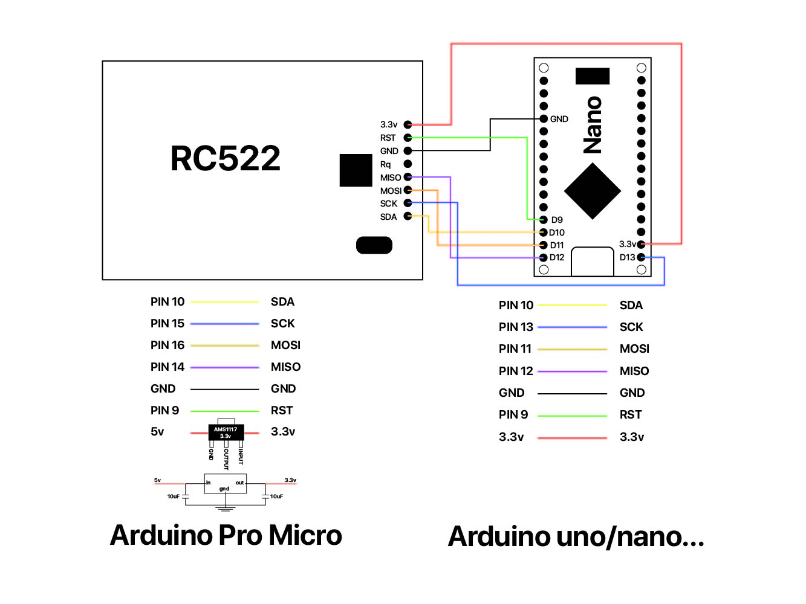
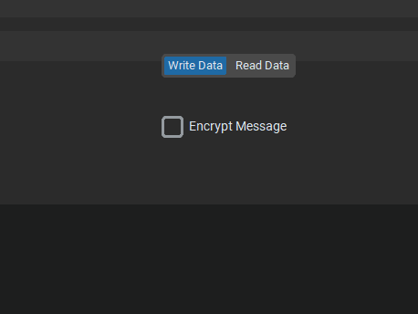

# KhabiByte

A modern Python GUI application for reading and writing data to RFID cards using Arduino and RC522 module.

## Features

- Modern dark-themed GUI using CustomTkinter
- Serial communication with Arduino
- Read and write data to RFID cards
- Vigenère cipher encryption/decryption
- Real-time status updates
- Professional and smooth interface

## Hardware Requirements

- Arduino (Uno, Nano, Pro Micro etc.)
- RC522 RFID module
- RFID cards/tags
- Connecting wires

## Wiring

Connect RC522 to Arduino:
- SDA/SS -> Pin 10
- SCK -> Pin 13
- MOSI -> Pin 11
- MISO -> Pin 12
- IRQ -> Not connected
- GND -> GND
- RST -> Pin 9
- 3.3V -> 3.3V

## 📷 Images

## Installation

1. Install Python dependencies:
\`\`\`bash
pip install -r requirements.txt
\`\`\`

2. Upload the Arduino code to your Arduino board

3. Run the Python application:

codes/

\`\`\`bash
python KhabiByte.py
\`\`\`

## Usage

1. Connect your Arduino via USB
2. Select the correct COM port and click "Connect"
3. Use the "Write Data" tab to write messages to RFID cards
4. Use the "Read Data" tab to read data from RFID cards
5. Enable encryption checkbox for secure messages

## Encryption

The application uses Vigenère cipher for encryption:
- Check the "Encrypt Message" box when writing
- Enter a key when prompted
- The same key is required for decryption when reading

